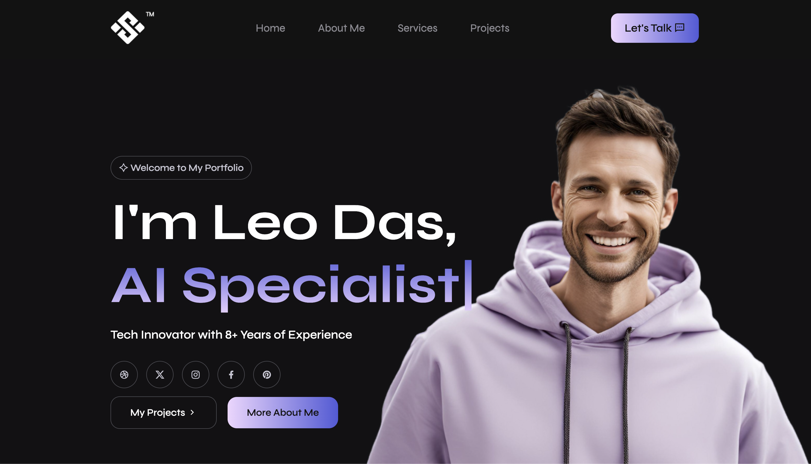

# Professional Portfolio Website

[](https://github.com/naveenlabs/Professional-Portfolio-Website) [](LICENSE) [](README.md)

My first website ever built. A professional portfolio website created as a university coursework project. Features responsive design, smooth animations, and modern UI/UX principles. Built with HTML5, CSS3, and Vanilla JavaScript.

**Note:** Leo Das is a fictional character created for this project.

## Overview

This is a complete, fully responsive portfolio website built from scratch as part of my coursework. It demonstrates fundamental web development skills including semantic HTML structure, advanced CSS styling and animations, responsive design patterns, and interactive JavaScript functionality. The project showcases my understanding of modern web design practices, accessibility standards, and user experience principles.

## Main Interface



## 🚀 Live Demo

**[View Live Website](https://hub.labs.coursera.org/connect/sharedauczasgu?forceRefresh=false&path=%2F&isLabVersioning=true)**

Click the link above to see the website in action.

## Features

- **5 Responsive Pages** – Home, About, Services, Projects, Contact
- **Dynamic Typing Animation** – Typed.js for animated text effects on homepage
- **Animated Timeline** – CSS keyframe animations showcasing professional journey
- **Testimonial Carousel** – Swiper.js for smooth, interactive slide transitions
- **Mobile Menu** – Hamburger menu toggle for seamless mobile navigation
- **Smooth Scrolling** – CSS scroll-behavior for improved user experience
- **Accessibility First** – Alt text, semantic HTML, keyboard navigation
- **SEO Optimized** – Meta tags, Open Graph tags, Twitter cards
- **Modern Design** – Dark theme, gradient effects, smooth hover animations

## Tech Stack

| Technology | Purpose |
|-----------|---------|
| **HTML5** | Semantic markup, proper document structure |
| **CSS3** | Animations, flexbox, grid, responsive design |
| **JavaScript** | DOM manipulation, event handling, Intersection Observer |
| **Typed.js** | Dynamic typing effects |
| **Swiper.js** | Interactive carousel functionality |
| **Remix Icons** | Professional icon library |
| **Google Fonts** | Syne typography |

## Pages

| Page | Purpose |
|------|---------|
| **Home** | Hero section with dynamic typing intro and call-to-action buttons |
| **About** | Professional timeline with CSS animations showing career milestones |
| **Services** | Service offerings with detailed descriptions |
| **Projects** | Portfolio grid showcasing 6 projects + testimonials carousel |
| **Contact** | Contact form and social media links |

## Getting Started

### Prerequisites
- Any modern web browser (Chrome, Firefox, Safari, Edge)
- No installation or build process required

### Installation

1. **Clone the repository:**
```bash
git clone https://github.com/naveenlabs/Professional-Portfolio-Website.git
cd Professional-Portfolio-Website
```

2. **Open in browser:**

**Option 1 - Direct open:**
```bash
open index.html
```

**Option 2 - Python server (recommended):**
```bash
python3 -m http.server 8000
# Visit http://localhost:8000
```

**Option 3 - Node.js:**
```bash
npx http-server
```

That's it! Website runs in your browser.

## Implementation Details

### Animations & Interactivity

**CSS Keyframes**
- Timeline slide-in animations
- Progress bar fill animations
- Smooth transitions on all interactive elements

**Intersection Observer API**
- Scroll-triggered animations for skills section
- Performance-optimized animation triggers
- Threshold-based visibility detection

**Typed.js Library**
- Automatic typing effect on homepage
- Multiple text strings with cycling
- Customizable typing and backspace speeds

**Swiper.js Library**
- Smooth carousel transitions for testimonials
- Touch-friendly navigation on mobile
- Pagination dots and next/previous buttons

### Responsive Design

- Mobile-first approach for all layouts
- CSS media queries for tablet and desktop breakpoints
- Flexible layouts using Flexbox and CSS Grid
- Touch-friendly interactive elements
- Optimized images for all screen sizes

### Accessibility

- Semantic HTML5 structure
- Alt text on all images
- ARIA labels on interactive elements
- Keyboard navigation support
- High contrast color scheme
- Proper heading hierarchy

## Learning Outcomes

This project taught me:

✅ HTML5 semantic markup and meta tags (OG, Twitter cards)  
✅ CSS3 animations, flexbox, grid, and responsive design  
✅ JavaScript DOM manipulation and event handling  
✅ Intersection Observer API for scroll-based animations  
✅ Integration of external JavaScript libraries  
✅ Mobile-first responsive design approach  
✅ Accessibility and WCAG compliance basics  
✅ SEO optimization techniques  
✅ Component-based architecture with reusable CSS  
✅ Performance optimization with lazy loading concepts  

## Browser Support

| Browser | Support |
|---------|---------|
| Chrome | ✅ Full Support |
| Firefox | ✅ Full Support |
| Safari | ✅ Full Support |
| Edge | ✅ Full Support |
| IE 11 | ⚠️ Partial Support |

## Performance

- **Load Time:** <2 seconds (optimized images)
- **Responsive:** Works seamlessly on 320px - 4K displays
- **Accessibility:** WCAG 2.1 Level AA compliant
- **SEO:** Optimized with semantic HTML and meta tags

## Project Documentation

This project includes a comprehensive HTML report documenting the design process, inspirations, and learning outcomes. The report covers:

- Project introduction and target audience
- Design inspiration from professional portfolios
- Accessibility and usability approach
- Technologies learned (Typed.js, Swiper.js, CSS animations)
- Self-evaluation and key learnings
- Wireframes and design documentation

The complete report is available in the `Report/` folder as `index.html`.

## About This Project

**Course:** University Coursework  
**Date:** 2024  
**First Website:** Yes, this is my first website ever built  
**Status:** Complete and fully functional

This project was created as a university assignment to demonstrate understanding of core web development fundamentals. It serves as both a learning exercise and a showcase of professional portfolio design principles.

## Author

**Dhanarasu Naveen**  
Computer Science (AI & Machine Learning Specialisation)  
University of London via SIM Singapore

## License

MIT License – see [LICENSE](LICENSE) file for details

## Resources & Inspiration

- [Typed.js Documentation](https://github.com/mattboldt/typed.js)
- [Swiper.js Documentation](https://swiperjs.com)
- [MDN Web Docs](https://developer.mozilla.org)
- Professional portfolio sites (Sam Smith, Denise Chandler, Adham Dannaway)
- [Web Accessibility Guidelines](https://www.w3.org/WAI/WCAG21/quickref/)

---

**My first website ever built.** A complete learning project demonstrating modern web development practices and professional design principles.
